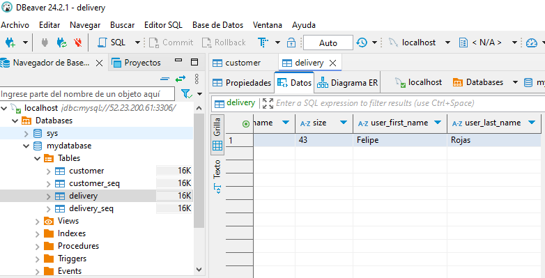
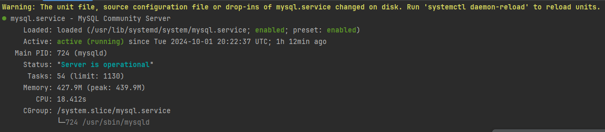
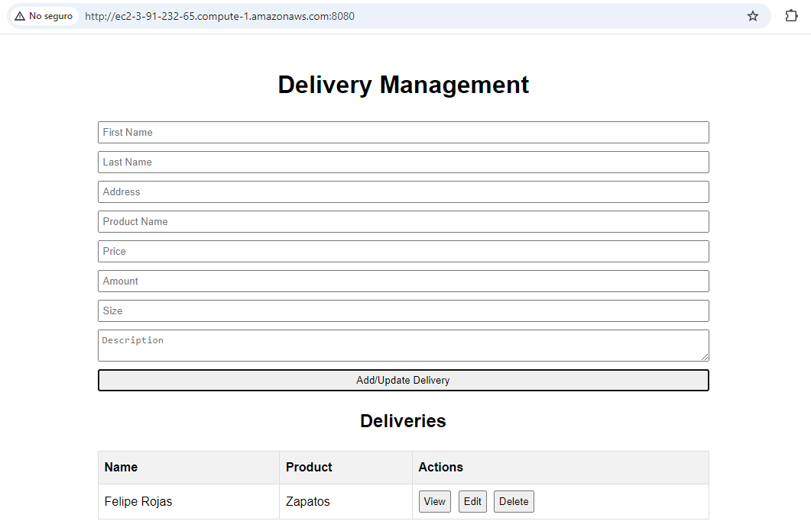
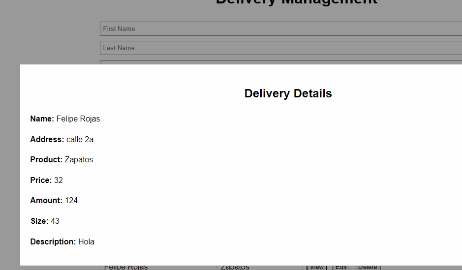
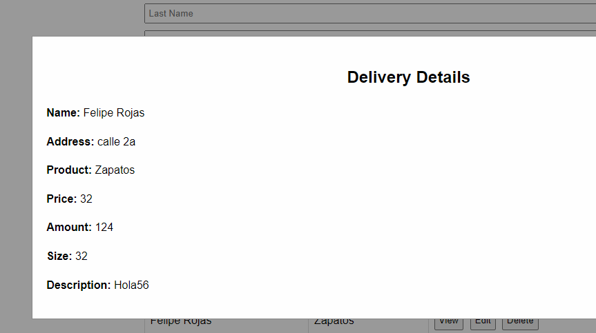
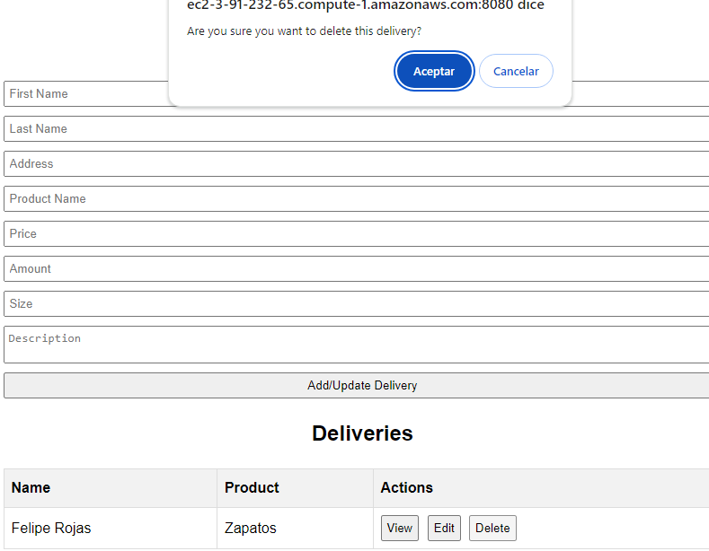

# Delivery Management System with Spring Boot and MySQL

This project is a delivery management system implemented using Spring Boot, JPA (Java Persistence API), and MySQL. The system allows users to perform 
CRUD operations (Create, Read, Update, Delete). The properties are stored in a MySQL database, and the application exposes a REST API for interaction.

